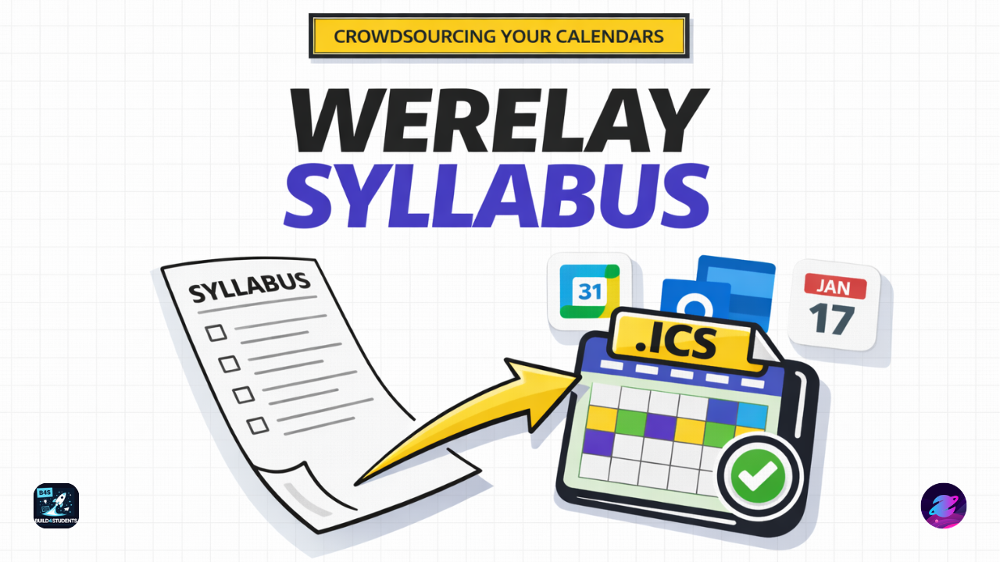
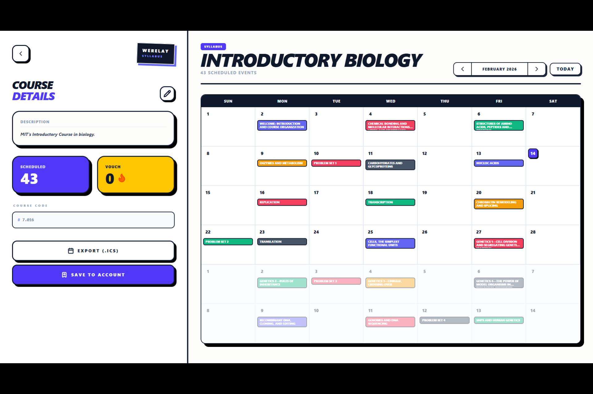
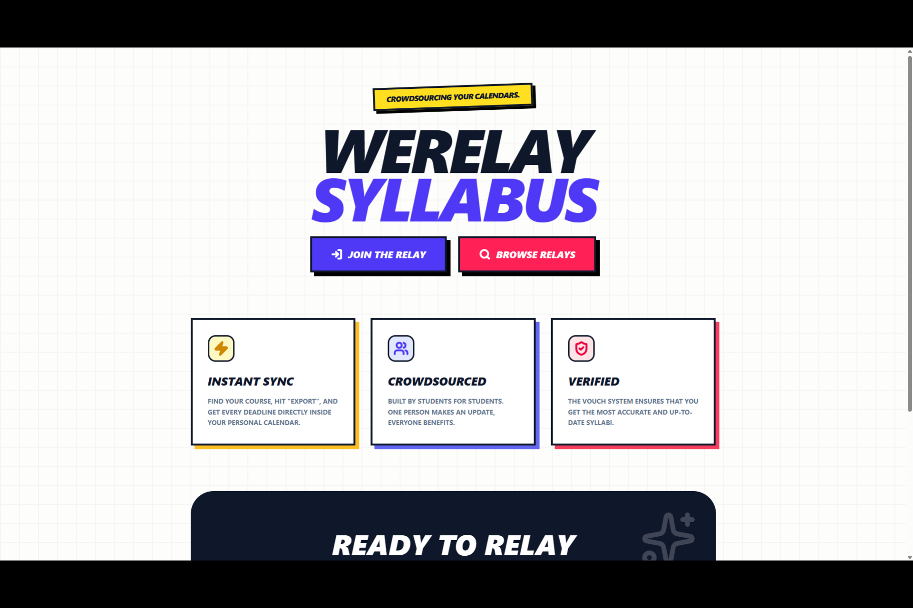
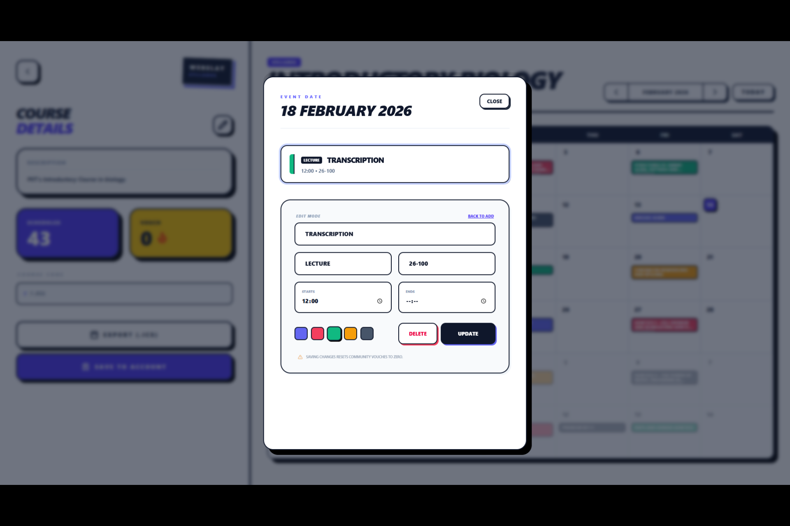
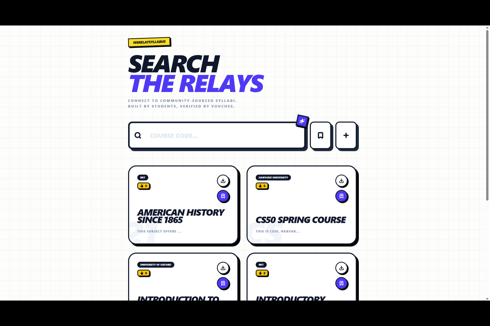
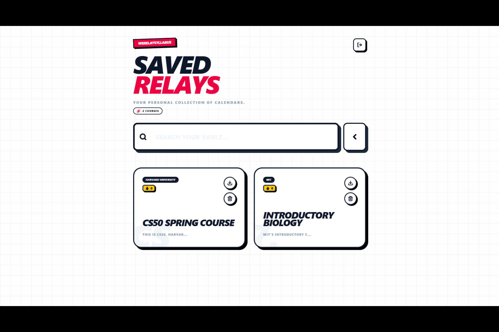
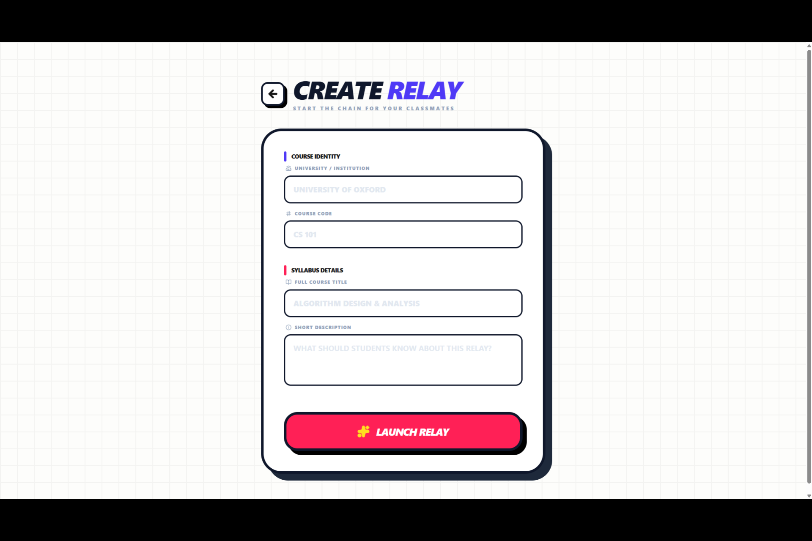
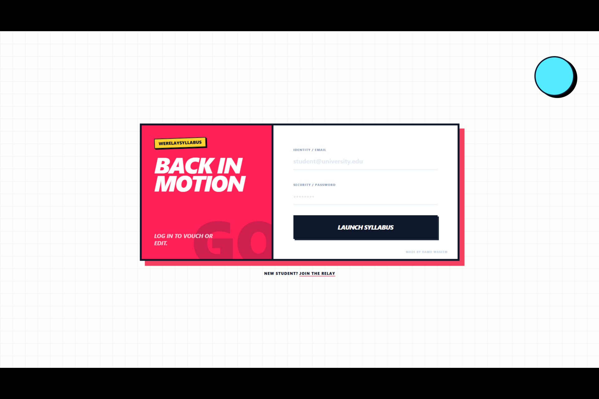
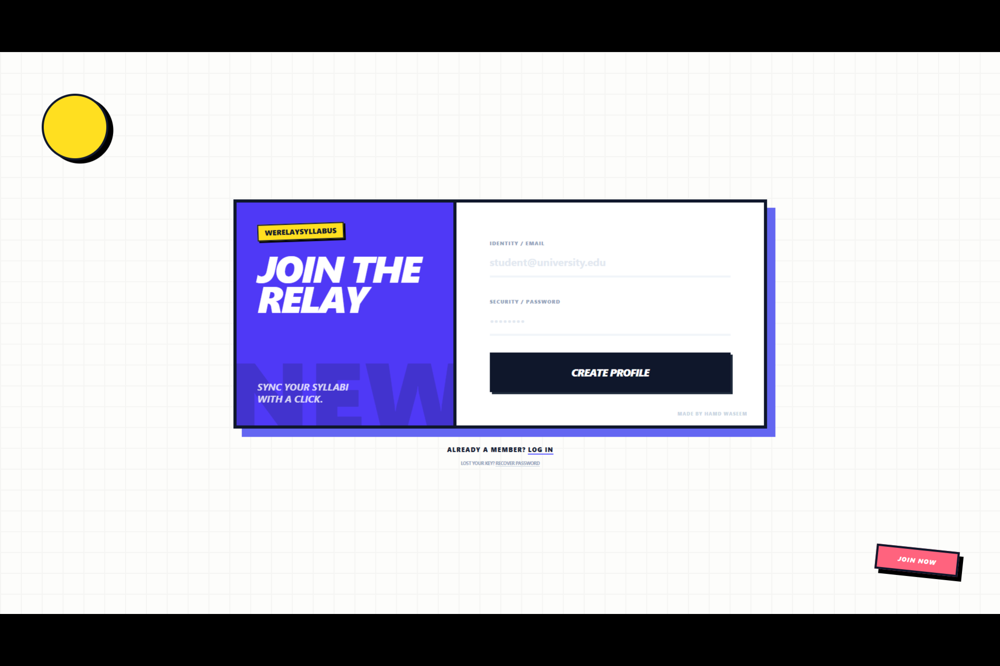

  <a href="https://www.youtube.com/watch?v=VUg1nECwY-E">
    <kbd>
      
    </kbd>
  </a>

  <h1>🗓️ WeRelaySyllabus 🗓️</h1>

  <h4> 
    <a href="https://we-relay-syllabus.vercel.app/">🔗 Try it out here</a> | 
    <a href="https://devpost.com/software/werelaysyllabus">🚀 Devpost page</a> | 
    <a href="https://www.youtube.com/watch?v=VUg1nECwY-E">▶️ YouTube demo</a>
  </h4>

  
This is my entry to the <a href="https://www.build4students.com/">Build4Students</a> hackathon!

  
  

    
<b>📷 Click to view screenshots</b>

     
    
    
    
    
    
    
    
    
  

## The Problem

Everyone knows how important syllabus deadlines are at college, university, and school. But professors usually hand out a PDF with the schedule in a format that matches nothing else you own, or worse, an old crumpled booklet printed thirty years ago.

To stay organized, thousands of students spend their first week of the term wasting hours tediously manually inputting dates into their Google Calendars. It’s a huge, collective drain on productivity, and everyone just accepts it as if there’s no better solution.

Well, now there is. Meet *WeRelaySyllabus*.

## What's WeRelaySyllabus?

If you're a new student, it’s simple! Get on the website, find your course, and export the calendar in the industry-standard **ICS format**. That’s it. One click to import into your favorite calendar software, and you're done. No sign-up, no fluff.

If the course isn't there yet? Everyone gets together to fill it out for the benefit of the whole class. A quick "event name," "description," and "time", boom. Everyone gets the memo.

## The Vouch System

Crowdsourcing is great, but how do you know the calendar you’re downloading is legit? That’s where the Vouch system comes in.

If you find a course calendar is correct and helpful, you click Vouch. A higher vouch count signals a trustworthy, community-verified calendar.

BUT: Any edit to an event resets the vouches to zero. This ensures that if a deadline changes, the community's trust is re-verified immediately.

## How I built it

I built the application using **`Next.js`** and **`Firebase`**, prioritizing a highly reactive and stateful UX.

* `Tailwind CSS` for a responsive, utility-first design.
* `Framer-Motion` for high-quality micro-interactions and smooth transitions.
* `Vercel` (over `AWS Elastic Beanstalk` or `AWS Amplify`) for seamless CI/CD.

As an **AWS Certified developer (3x)**, my instinct was to go serverless with Lambda and DynamoDB. However, for this hackathon, I made a strategic switch to Firebase. Its real-time Firestore listeners allowed me to implement the Vouch system instantly without managing complex (and expensive) WebSocket logic.

## Some challenges along the way...

* Deciding to move from the AWS stack I am comfortable with to Firebase was a challenge, but it was the right choice to prioritize development speed and cost-efficiency for a student-focused tool.
* The biggest hurdle was probably "trust" mechanism. Building the reset logic for vouches was essential to ensure that if a deadline is pushed back, the calendar's "verified" status is earned again.

## Accomplishments made with this project

* I’m proud that a student can go from "I have no calendar" to "I have every deadline for the year" in under 10 seconds without even needing an account.
* Successfully implemented a client-side generator that exports data into the iCalendar `RFC 5545` standard, making the app instantly compatible with Google Calendar, iCloud, Outlook, Notion, and more.
* Created a self-moderating community loop that solves the problem of misinformation without needing manual admin oversight.
* Made an intuitive UI that works quickly and easily for desktop and mobile.

## What I learnt

* AWS knowledge makes you want to build for "infinite scale", but hackathons teach you that building for immediate impact is more important. Firebase taught me how to move fast.
* In student productivity, every extra click is a reason to quit. This led to the "No Sign-In" download idea.

## What's next?

In the world of product shipping, this is called an MVP - Minimum Viable Product. It has the necessary features that make WeRelaySyllabus, WeRelaySyllabus. It's not a generic calendar app anymore and I believe it genuinely has the potential to fix this friction faced by students all the time. But... if I were to add more to this project, here's what I'd add.

* A Live ICS feature. This is generally the standard when it comes to calendar syncing, but I felt that an export was better just because of the nature of how fast calendars change. Plus, server caching would mean that it'd take ages for the calendar to actually update. But still, this would remove that subtle final friction - that click on the Export button.
* Maybe OCR recognition for uploading syllabi directly? While I couldn't have achieved that with Firebase, doing it is very much possible with other major cloud providers like AWS via Textract. It would definitely be a very very interesting addition!

 

But anyway, that's it for WeRelaySyllabus's pitch! I hope you find my project interesting, and if you'd like to try it out, the live demo is at **[https://we-relay-syllabus.vercel.app/](https://we-relay-syllabus.vercel.app/)**, the Devpost page is at **[https://devpost.com/software/werelaysyllabus](https://devpost.com/software/werelaysyllabus)** and you can check out the demo video over on my **[YouTube](https://youtube.com/@hamdivazim)**.